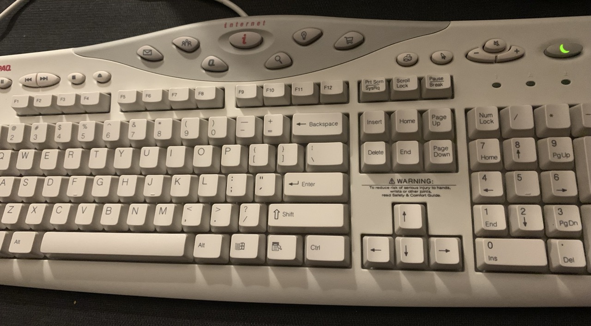
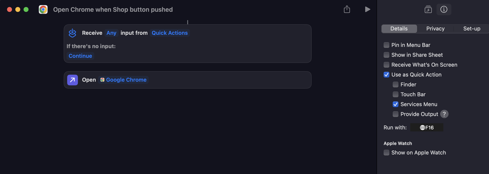

# Compaq Easy Access Keyboard Driver

A DriverKit project that re-maps certain Compaq media keys to their macOS equivalents, adapted from the [Apple sample code](https://developer.apple.com/documentation/hiddriverkit/handling_keyboard_events_from_a_human_interface_device)

This came about after picking up a Compaq keyboard with various media keys. The keyboard works when used with a USB-PS/2 adapter, but several of the media keys don't work or perform the wrong action. This driver listens for events processed by that USB-PS/2 adapter and changes the event triggered by the key press to the correct one.

## Supported features

Working buttons:
- Play/pause
- Next track
- Previous track
- Stop (same as play/pause)
- Mute
- Volume up
- Volume down
- Search (opens Spotlight)
- Shop (triggers F16 key press)
- Sleep (triggers Lock)

Unimplemented buttons:
- Email 
- People 
- Q
- I
- Bulb
- Print
- Rocket

Unimplemented buttons are due to their PS/2 scan codes not having corresponding HID usage pages/IDs. This prevents a USB-PS/2 adapter from translating the button press into something the OS can understand. Using tools like Wireshark to sniff the USB traffic also confirm that no data is sent when these unimplemented buttons are pushed.

It might be possible using a custom adapter using something like an Arduino to capture and convert the PS/2 interrupts to the most applicable HID usages, but that's for another day.

## Building

The `Info.plist` file within the driver should be updated to use the correct `VendorID` and `ProductID` belonging to your USB-PS/2. These values for your device can be found in the System Report tool.

There is a helper application bundled with the project, which can be run after the driver has been built. The application can activate or deactivate the driver, and will trigger the appropriate macOS security prompts to enable the driver within the System Settings.

## Appendix

### Shop button

The Shop button has been set to trigger an F16 button press, which can be used in apps like Shortcuts to trigger an action, such as opening a web browser.

### Sleep button

The Sleep button triggers a system lock using the `kHIDUsage_Csmr_ALTerminalLockOrScreensaver` usage, as the original value of `kHIDUsage_GD_SystemSleep` only triggered some of the time. It also only showed a dialog asking whether to sleep/restart/shutdown rather than sleeping straight away.

### HID keyboard mappings

These are the HID descriptors of the keys before the driver is applied. All keys use a HID usage page of `kHIDPage_Consumer`, except for the re-mapped `Shop` key using `kHIDPage_KeyboardOrKeypad` to simulate a standard key press, or the `Sleep` button which is re-mapped from `kHIDPage_GeneralDesktop` to `kHIDPage_Consumer` to support the Lock action.

Any blank keys don't have an applicable HID descriptor, and I haven't figured out a nice way of getting a USB-PS/2 adapter working for those keys.

| **Button**                 | **PS/2 scan code** | **HID Usage Page** |             | **HID Usage** |             | **HIDDriverKit Default Enum**      | **Compaq Driver Enum**           |
|----------------------------|--------------------|--------------------|-------------|---------------|-------------|------------------------------------|----------------------------------|
|                            |                    | **Hex**            | **Decimal** | **Hex**       | **Decimal** |                                    |                                  |
| **Play**                   | E0 22              | 0x0C               | 12          | 0xE5          | 229         | `kHIDUsage_Csmr_BassBoost`         | `kHIDUsage_Csmr_PlayOrPause`     |
| **Prev**                   | E0 10              | 0x0C               | 12          | 0xB6          | 182         | `kHIDUsage_Csmr_ScanPreviousTrack` | `kHIDUsage_Csmr_Rewind`          |
| **Next**                   | E0 19              | 0x0C               | 12          | 0xB5          | 181         | `kHIDUsage_Csmr_ScanNextTrack`     | `kHIDUsage_Csmr_FastForward`     |
| **Stop**                   | E0 24              | 0x0C               | 12          | 0xB7          | 183         | `kHIDUsage_Csmr_Stop`              | `kHIDUsage_Csmr_PlayOrPause`     |
| **Eject**                  | E0 2C              |                    |             |               |             |                                    |                                  |
| **Mail**                   | E0 1E              |                    |             |               |             |                                    |                                  |
| **People**                 | E0 13              |                    |             |               |             |                                    |                                  |
| **Q**                      | E0 14              |                    |             |               |             |                                    |                                  |
| **i**                      | E0 23              |                    |             |               |             |                                    |                                  |
| **Search**                 | E0 21              | 0x0C               | 12          | 0x221         | 545         | `kHIDUsage_Csmr_ACSearch`          | `kHIDUsage_Csmr_ACSearch`        |
| **Bulb**                   | E0 15              |                    |             |               |             |                                    |                                  |
| **Shop**                   | E0 32              | 0x0C               | 12          | 0x225         | 549         | `kHIDUsage_Csmr_ACForward`         | `kHIDUsage_KeyboardF16`          |
| **Print**                  | E0 68              |                    |             |               |             |                                    |                                  |
| **Rocket**                 | E0 1F              |                    |             |               |             |                                    |                                  |
| **Mute**                   | E0 20              | 0x0C               | 12          | 0xE7          | 231         | `kHIDUsage_Csmr_Loudness`          | `kHIDUsage_Csmr_Mute`            |
| **VolDown**                | E0 2E              | 0x0C               | 12          | 0x153         | 339         | `kHIDUsage_Csmr_BassDecrement`     | `kHIDUsage_Csmr_VolumeDecrement` |
| **VolUp**                  | E0 30              | 0x0C               | 12          | 0x152         | 338         | `kHIDUsage_Csmr_BassIncrement`     | `kHIDUsage_Csmr_VolumeIncrement` |
| **Sleep**                  | E0 5F              | 0x01               | 1           | 0x82          | 130         | `kHIDUsage_GD_SystemSleep`         | `kHIDUsage_Csmr_ALTerminalLockOrScreensaver`       |

## References

- [Useful list of HID usage pages/IDs and their PS/2 scan codes](https://download.microsoft.com/download/1/6/1/161ba512-40e2-4cc9-843a-923143f3456c/translate.pdf)
- [Very useful list of Compaq keyboard PS/2 scan codes](https://homepages.cwi.nl/~aeb/linux/kbd/scancodes-5.html)